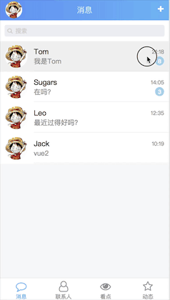
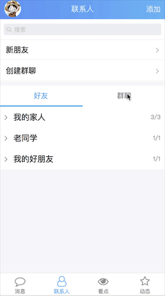

# 基于Vue2.0高仿手机QQ的单页面应用

## 概述

这是一个使用Vue2.0来模仿手机QQ的WebApp，出于个人兴趣和对Vue的喜爱写下这个项目，目前处于持续开发阶段。

有什么建议和问题欢迎大神们在[Issues](https://github.com/suguoyao/vue2-QQ/issues)提出，感兴趣的朋友给个充满动力的star吧！

**持续更新中**

最近更新时间：2018-04-06

## 效果预览 

[Demo预览请点击这里](http://suguoyao.com/message) 


（如果是电脑端，请用chrome手机模式预览）


## 目标

### 页面模板
- [x]  Header
- [x]  Tabbar
- [x]  消息页
- [x]  联系人页
- [ ]  看点页
- [ ]  动态页

### 功能
查看最近消息列表list(根据最近聊天时间降序排序)

左滑删除最近聊天消息

左滑置顶/取消置顶最近聊天消息

查看联系人分组和群分组

## 目前实现

**最近联系列表**




**查看联系人分组**




## Build Setup

``` bash
# 安装
npm install

# 运行
npm run dev

# 发布
npm run build
